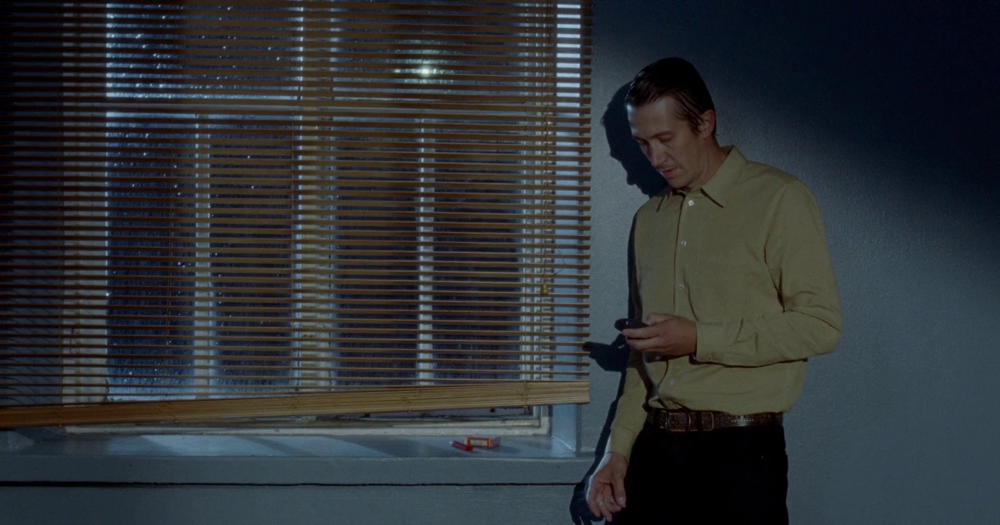
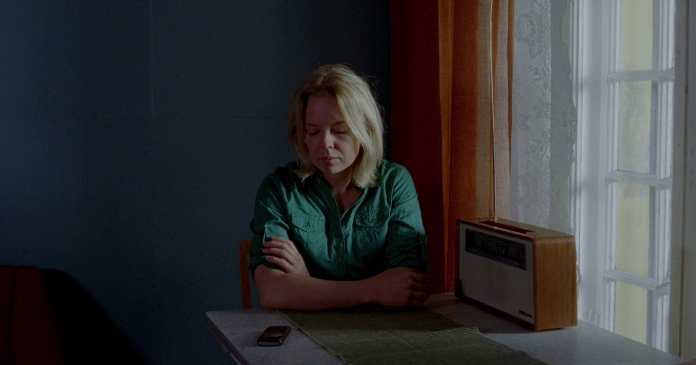
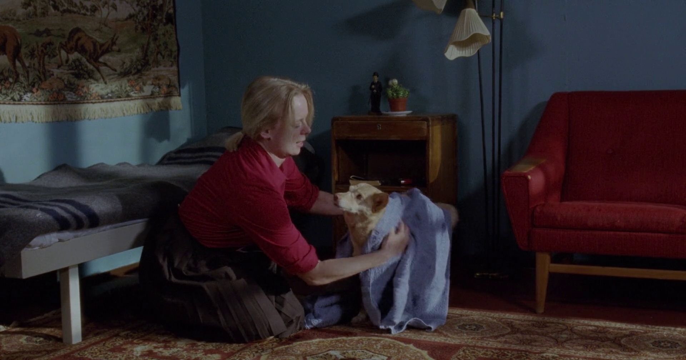
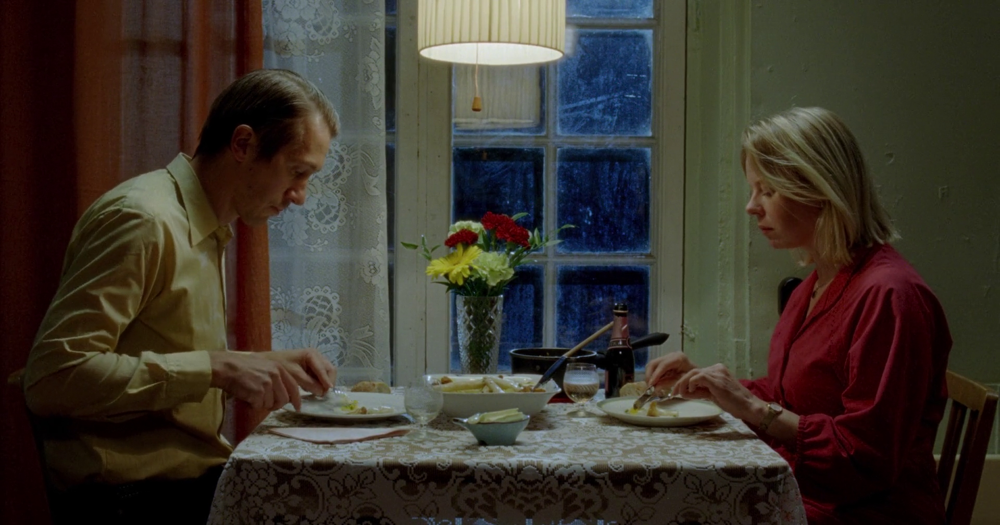
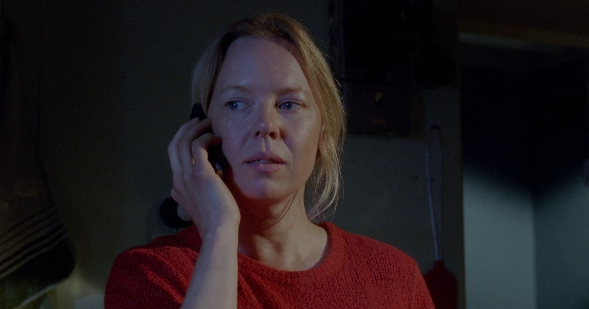
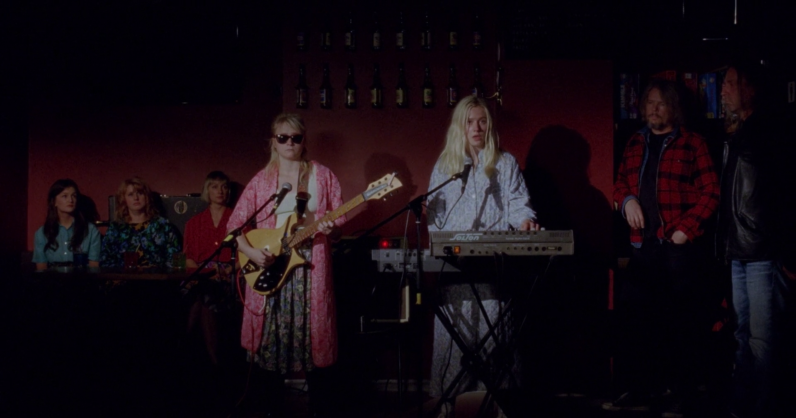
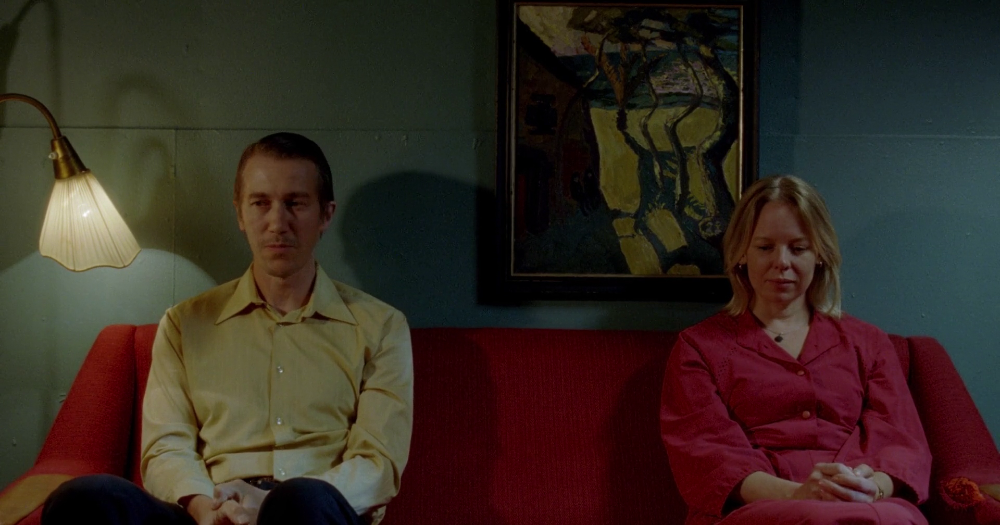
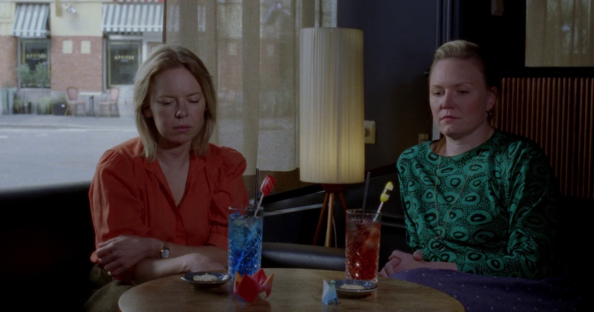
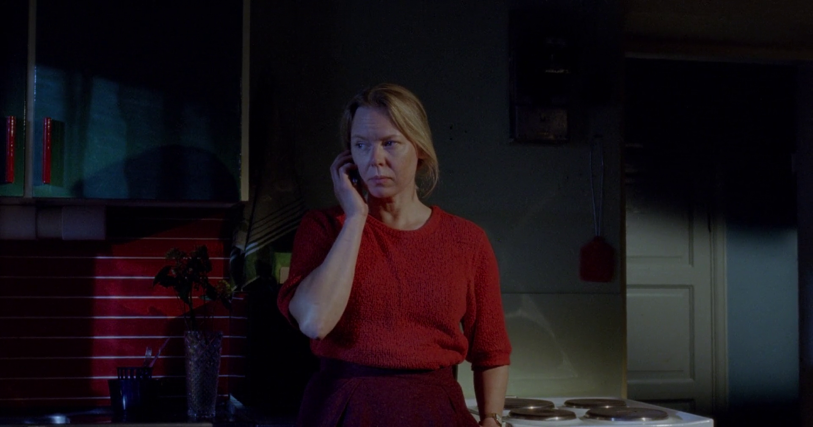
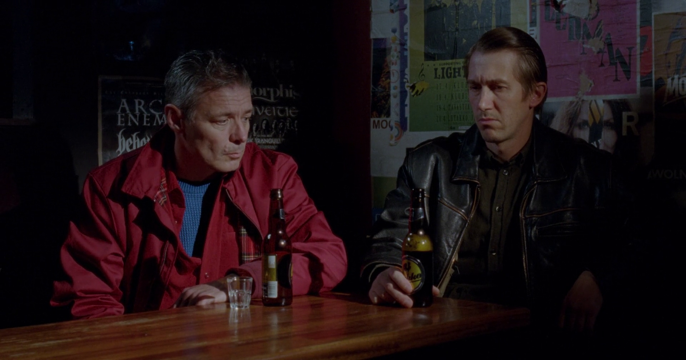

A sweet, poignant, and yet distinctive love story, Fallen Leaves won't leave me for long, I suppose. It is so simple that it is sophisticated. I absolutely loved this film. Here are the things that impacted me:

### 1. Empty frames
There are a few scenes, where the frames are empty even long after the characters have left the frame. Why would the director do so? I presume he did so to make us belong to the space and put us in the room. It did have an impact on me. I felt as if I'm in the room with the characters and not watching them on the screen.

### 2. Lighting
The lighting is exquisite and top notch. Each frame is a painting. However, the way this film's lighting differentiates is in its treatment of lights – the lights are intentional, devoid of establishing any source, and are on the face, literally. The lights don't merge organically into the scene, but rather stand out.

In fact, there are many places where the light is so intense the shadows take over the frame. Sometimes you are looking at a frame, where just their faces are lit, pale and porcelain, and wonder, where is the light coming from? They almost resemble apparitions. There are rich, deep reds, creams, greens, and browns throughout the film.

A few frames from the film here (slide).

:::gallery

:::

### 3. Set design
I found the set design to be the highlight of the entire film. It is so minimalistic that one can't help but notice the oddity of it. Shitty composite-wood tables and cheap lace cloths have never looked so oddly welcoming.

There are barely props except for a radio, a flower vase, and a wall frame, and a red sofa. However, the walls are painted brightly creating a contrast. Don't mistake the film's set design style for that of Wes Anderson's. Fallen Leaves emulates 1950s while still deliberately placing the story in 2023 (the radio constantly conveys news on Russia-Ukraine war). What is the director trying to convey via this minimalist and yet loud set design style? I need to find answers to this.

Another thing I liked – there are just two characters for almost 95% of the film!

Thank you, Aki Kaurismaki. Now I'm eager to watch all your films!