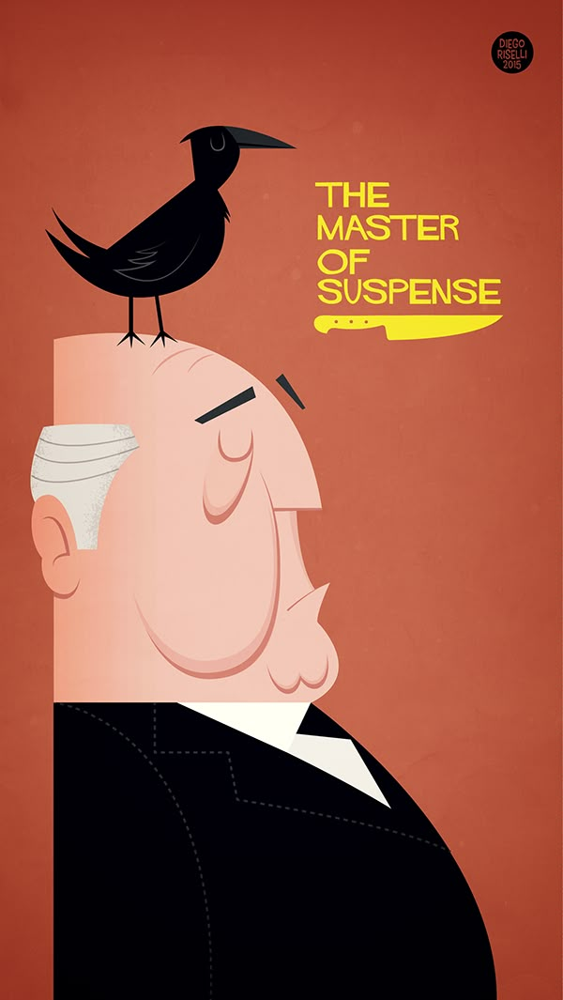

> There is no terror in the bang, only in the anticipation of it.
> – Hitchcock

This timeless principle was beautifully shown in Weapons.

It reminded me of *Kaun*, a cult classic film by RGV. Look at this scene from *Kaun* – 16 minutes, 1 character, exquisite sound design. Edge of seat!

  <iframe
    src="https://www.youtube.com/embed/VEUB_DINoZ0"
    title="YouTube video player"
    frameborder="0"
    allow="accelerometer; autoplay; clipboard-write; encrypted-media; gyroscope; picture-in-picture; web-share"
    allowfullscreen
  ></iframe>

Now a similar scene in this year's one of the massive hits, Weapons.

  <iframe
    src="https://www.youtube.com/embed/oyeb3JkYfpw"
    title="YouTube video player"
    frameborder="0"
    allow="accelerometer; autoplay; clipboard-write; encrypted-media; gyroscope; picture-in-picture; web-share"
    allowfullscreen
  ></iframe>

That TV reflection shot! I wanted to whistle in the theater! Exquisite.

Thank you, RGV & Hitchcock.
