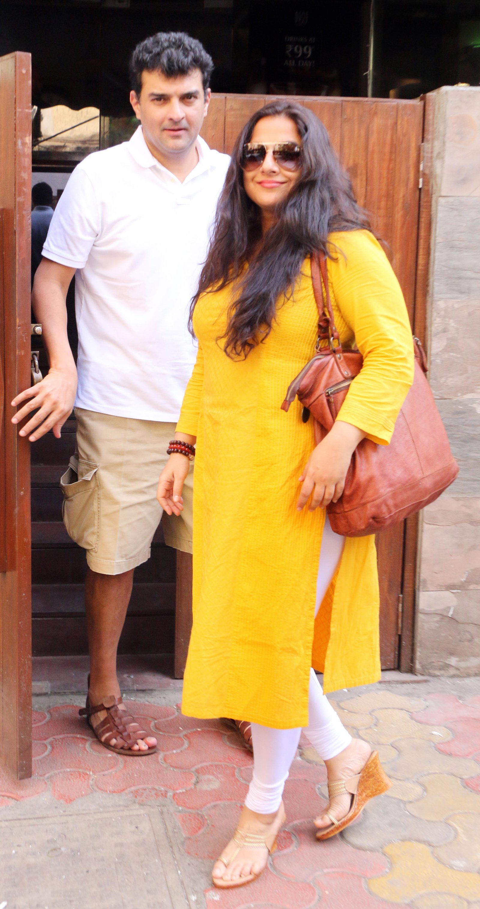

*PS: Wrote on phone as a WhatsApp message.*

***

Walking on those streets of Juhu, her fingers rubbed against mine. Amul butter felt sandpaper in comparison.
And I'm still deciphering why I was blushing. Oh yes, she is wonderful in every aspect, but I wasn't a mad-fan of her.

We reached a cafe. Rather she reached, I merely followed her to a corner seat. A coffee with her! Who would have thought! But she's not Tabu, or Revathi, or Disha Patani, so stop smiling.

"*Oh he's here! Perfect.*"
"*Meet my husband, Sid.*", she formally introduced.
Smart couple, I thought. And spread myself across the table narrating my story.

Amidst narration, she joked – "*Oh, there you go, Sid, he kills me abruptly!*"
Sid looked at me.
"*Sid, if Bikhu Mahtre had instead died in a climax chase on the streets of Mumbai, would you remember as you do now?*"

Ding Dong.

I woke up to find neither Vidya Balan nor Siddharth Roy Kapur in my bedroom.
