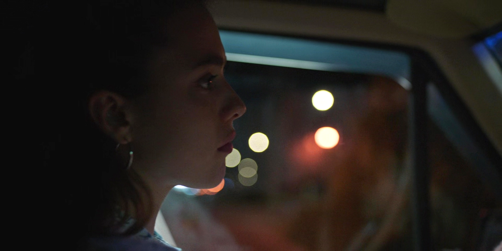

I pressed the brake hard. Tyres came to a screeching halt.

About fifty meters ahead, a policeman stood right at the center of the road. He waved at me. The entire road ahead was empty, at night 8 PM, on one of the main roads in the third most populated cities of the country. Something was off.

As he saw me slowing down, the policeman went and sat on his designated police bike. Realization hit me then – I broke the traffic signal. The signal had turned red when I drove past it, and thus the road ahead was sans vehicles.

I stopped the car right at his bike and walked to him. Sitting on his bike, tad plump, holding a walkie-talkie, he was conveying a message. I waited for him to finish.

*"Sir, I didn't see the signal."*

*"But I saw you!"*, he retorted immediately, in a thick Bengali accent.

Tough cookie, how do I crack him, I wondered. Gandhi could have recused me, but he's the last resort.

*"License?"*

I handed it to him promptly from my wallet. He looked at the license card.

*"Bijoy. South."*

My identity was reduced to two words. And both were incorrect.

*"Sir, Vijay, and Andhra Pradesh."* I corrected him in reflex.

That drew his ire and stare.

*"So, what are you doing here?"*

*"Work."*

He smirked.

*"The entire youth of Bengal is going south and you did the reverse."*

I looked at my watch; it was getting late for the movie. And here I was discussing development economics with a traffic policeman.

*"Sir, I won't do it again. I didn't see the signal in a rush. It was a genuine mistake."*

*"Where are you rushing to?"*

*"Sir, movie. Darren Aronofsky's movie."*

*"Aroshonko?"*

*"Sir, the guy who made Whale, Wrestler, Mother and …"*. Why was I listing Aronofsky's filmography to him? *"I'm a big fan of his, Sir, you should try his films."*

His face drew blank, I couldn't read.

*"Sir, it's getting late, please let me go."*

He looked at the car number plate.

*"Whose car is this?"*

*"Hers"*, I responded pointing to her in the car. *"She's a little tired driving all day today, so I took over."*

His investigation intensified.

*"What's her name?"*

*"Romani."*

*"Don't you have Bengali friends here?"*

That was uncalled for. He was complaining about Bengal youth migrating out of the city, and now he is pushing me to have Bengali friends. What next? Will he push for a Bengali bride?

*"She is Bengali!"*, I responded a little louder, almost as if I hit a cashback lottery.

*"I haven't heard that Bengali name in my entire life."*

I never imagined to be in Bengal, but here I'm with you discussing migration and Bengali names, ain't I? But I shut my thoughts.

*"She is, Sir. Believe me. She is indeed a true-blue Bengali, born and bred here in Kolkata."*

He looked right into my eyes.

*"Are you teaching me Bengali names and culture?"*

Oops, he turned offensive.

*"You can talk to her, Sir"*, and turning back, added, *"I'll get her"*.

He too started walking with me. From the distance, due to light reflection on the windshield, I couldn't see her in the car. We reached the driver's seat.

With the policeman beside, I knocked on the window and gestured to lower the window glass. She obliged.

*"What happened?"*

The policeman wants to speak to you.

*"Why? What is it?"*

The time it would have taken to explain to her was higher than the time it would take for her to speak to the policeman.

*"Just speak to him"*, and I added, *"in Bengali"*.

*"And switch on the dome light."* It was dark inside.

I moved aside to give space to the policeman. At that moment, she quickly switched on the center light and checked her face in the mirror. Her radiance bloomed under the dome light. Her brown eyes could consume everything around. The kohl around her eyes turned them mystical. Her nose ring glinted and ear rings danced as she adjusted herself. Her hair shone like the waves shining, on a sunny day, hitting the shores. She adjusted her hair, pushing the strands behind her ear neatly.

*"Please ask yourself, Sir."*

The policeman bent a little and put his head inside a little to speak to her.

Moments passed. Many seconds passed. I couldn't hear a word from inside the car.

*"Sir?"*

*"Sir?"*

I shook him gently, *"Sir?"*

His head came out of the car, but he didn't look at me.

*"Ah.. Yes.. Hmm.. Mmm.. Yes."* He made these sounds, adjusting his shirt.

I understood though. Allowing a moment, I asked.

*"Sir, how can a man not be distracted with her sitting beside?"*

He just gestured me to leave. Simply. No words were exchanged.

I pressed the accelerator as hard as I could!

***

Sitting in the theater, we reached just at the right time before the initial credits. The credits read – *Written and Directed by Darren Aronofsky.*

Instinctively I blurted, *"Darren Aroshonko"*, drawing a smile.

She looked at me confused. In the varying light colours, her face was even more beaming.

*"Thank you, Darren Aronofsky"*, I said to myself and focused on the film!
