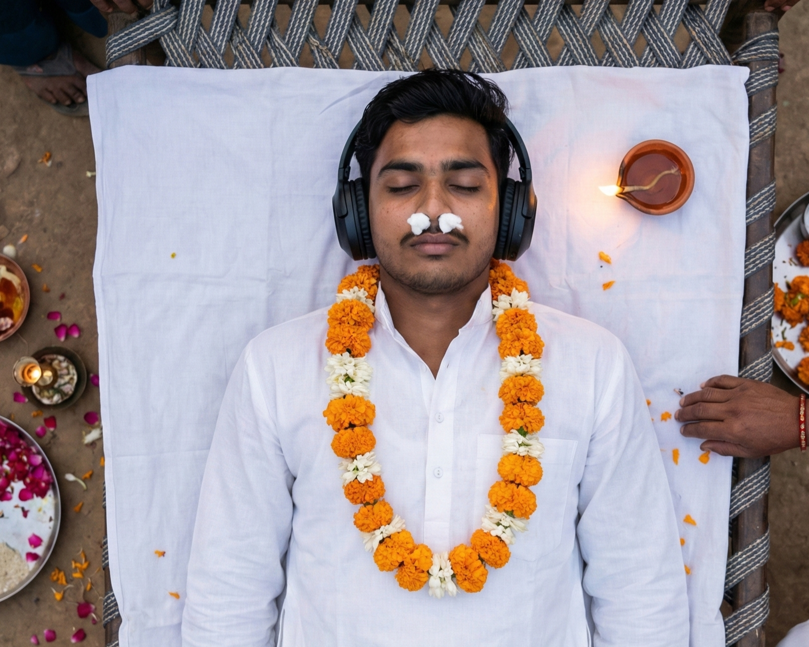

What is your funeral playlist?

We have long drive playlist, heartbreak playlist, wedding playlist, after-party playlist, and so on. But I haven't come across a funeral playlist yet.

Wouldn't we all wish to depart while our favourite songs are playing in the background?

Invariably at funerals I've been to, I hear Bhagavad Gita playing. And if the person is of Telugu origins, then it is undoubtedly the legendary Ghantasala singing Bhagavad Gita verses. Ghantasala's version has 106 verses/sholkas, against the 700 in original text. It has pearls of all of humanity's wisdom packed into simple lines for laymen to understand.

One of my favourite verses is – *"It is far better to discharge one's prescribed duties, even though faultily, than another's duties perfectly. Destruction in the course of performing one's own duty is better than engaging in another's duties, for to follow another's path is dangerous."*

Great verses, legendary recitation. But why at a funeral?

Here's my reasoning for not playing Bhagavad Gita at the funeral.

There are three kinds of people at funerals.

1. *The Mourners.*
  - These are people in grief due to the loss of the dead. Includes friends, close relatives, acquaintances who were impacted when s/he was alive.
2. *The Logisticians.*
  - These are usually relatives, who are busy taking care of cremation/burial. Though our bodies are naturally decomposable, the rituals demand a great deal of care after we are dead.
3. *The Indifferent.*
  - These are people who are present by default and have known/heard of the dead. They have no emotional connection with the dead and are present to fulfil social obligations.

Do any of these groups listen to Bhagavad Gita playing in the background? It is anyone's guess.

So, here's my proposal –

**Everyone should have a funeral playlist.** (At least the funeral audience will be entertained!)

I'm building mine and will post it here later. But for now, remember to start my funeral playlist with – Interstellar!

*Cornchase Field, No Time for Caution, Mountains, STAY, Day One*, choose anyone or the entire album! The *Interstellar* album always transports me, and during my last journey, it might as well really transport me.

Also, during my funeral, please do take song requests from anyone willing!

Cheers to music!

Cheers to life!

***

PS: My dear friend, Tanaya, added the following:

*"You know what came to my mind? What if your playlist grows with you — every year you add one song that defined that phase of your life. So, when the time comes, it's like your entire journey plays itself out in sound…isn't it?"*

Cheers to that, Tanaya!
