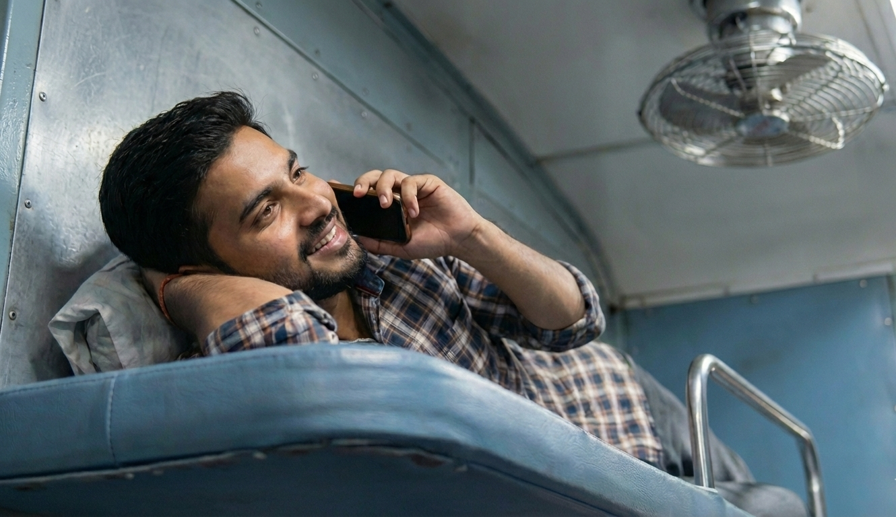

I took the upper berth, and wrapped myself in the bedsheet, and went right into sleep.

Until…

A classic old Hindi film song about a broken heart came blaring loudly from someone's phone.

The legendary Lata Mangeshkar song played loudly from someone's phone. I went through phases – first I waited for the song to end, then I ignored it, eventually I accepted it — until I couldn't.

I emerged from the darkness under the bedsheet and gestured to the gentlemen, on the opposite upper berth, to lower the volume. To my utter surprise, he not only realized the volume was loud, but also stopped playing songs. I thanked him with a smile, and dove back into my bedsheet.

*"Aaj breakfast mein omelette tha.*

*Arrey bread Omeleete..*

*(even more loudly) Arrey omelette rey omelette . Sunnai nahi dera kya?"*

*"Bread omelette, Chai, Biscuit. Ek dum sahi tha."*

He was so loud that even the train's loco pilot must have heard him. I had to convey this to him. I looked at him. This time he smiled back, and continued his conversation. He didn't realize he was loud!

*"Lunch mein Daal tha, Chicken tha, Roti tha, Dahi tha, Achar tha… Pani bottle bhi diya."*

The entire village outside now knew the menu on the train. A momentary pause later –

*"Aaj raat karenge na party.. Aa raha hoon main. Prakash ko bol ready rakhne."*

*"Arrey nahi rey.. Main batata hoon sunn."*

I had to act.

*"Sir, aap gaana bajao na. Accha music taste hai aapka."*

"At least his phone has a maximum volume limit", I thought to myself.
