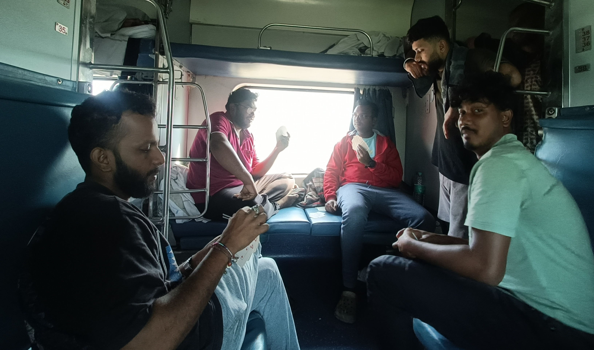

Among the plethora of film festivals in India, IFFI (International Film Festival Of India) is the biggest and most reputed one. It is government run and has been running annually since 1952!

This year was the 56th edition of the event, and my first! Academically, my batch is to attend the event next year, however, I had the urge to attend this year itself. So, I tagged alone with my seniors, who were gracious to accommodate me. Thus started the ~2000 KM, 41 hours train journey to Goa, the permanent venue of IFFI.

*

I had no rigid plans at the 8-day event. I'm not a believer of networking for the sake of networking. So, I went with a blank slate to experience whatever comes along. Broadly, I wanted three things:
1. Experience/learn about the events in IFFI.
2. Watch the films I wanted to.
3. Sneak into Waves to listen to friends firsthand!

### MasterClass

In addition to the above three, I attended a few FTI exclusive sessions with Mukesh Chabbra, Prime/Netflix Heads, etc.

The Mukesh Chhabra session was particularly insightful, given that I was uninitiated in casting. He simply shared two profound ideas:

1. **We are casting characters, not actors!** That means when a character is written on paper, the director isn't looking for best actors, s/he is looking for actors who fit the characters.
2. **Actors are greedy.** They pounce on characters that challenge them. Use this as an advantage!

It might sound simple, but it was a revelation to me in that room!

### Films Watched

240 films were to be screened at IFFI over 8 days. It helps if one plans, given the demand-supply of theaters, audience, and films. Unlike most film festivals, films screened at IFFI can only be booked via an app. In fact, ticket booking is a race – technically one can just login in app and book any film, at your time of convenience. However, given the demand (10000 registrations), the tickets exhausted within 2-3 minutes of opening at 8AM. Tatkal vibes!

I'd ample time on the train to plan what I wanted to watch. And by the end of the festival, I had covered my list and a couple more films, averaging 3 films a day.

### Waves Film Bazaar

Though I wasn't an official participant at Waves Film Bazaar, I was fortunate enough to have Rajat, who took me to the event. Thank you, Rajat! The event happens at Marriott Miramar, deliberately away from the main locations.

Another interesting event introduced in Waves Bazaar this year quite surprisingly yet unsurprisingly was – **AI Film Hackathon!** I watched all the AI films made there, and I can humbly say – they can be made better.

1. Most of the AI films used voiceover.
2. In the current shape, AI is great for animation, animals, and sci-fi, not for human intricate expressions, and this advantage was not exploited.

Next year, if not for script lab, then I must be in the AI Film Hackathon!

*

Not surprisingly, I didn't visit a single beach in Goa. In fact, I didn't even venture out anywhere! IFFI in a way consumed me. Overall, I enjoyed the train journey, I enjoyed knowing, interacting, and conversing with 5th batch seniors (at times in stupor!), I enjoyed the films, the events, and the festival vibes. More stories in draft!

It was a celebration of cinema. And next year I hope and aim to celebrate my cinema there!