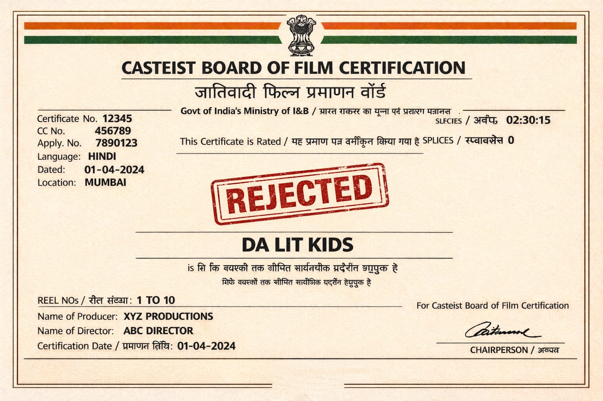
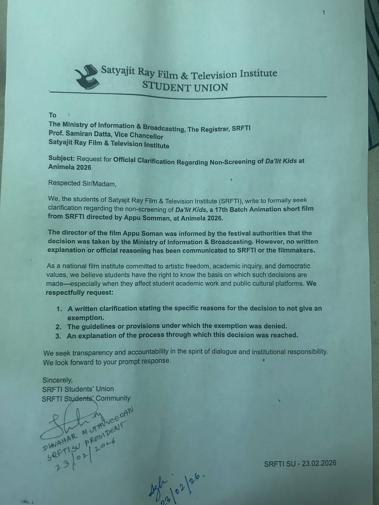

> I have a perfect cure for a sore throat: cut it.
>
> *– Alfred Hitchcock*

The first time I watched the short film *Da'Lit Kids* was at International Documentary and Short Film Festival of Kerala *(*IDFSSK*)* 2025. I was excited to be part of the festival as my own team's film was to be screened.

Along with me, there were a couple of my seniors/peers whose films were to be screened including Prakash's team's *Peepal Ka Ped*, Aniket's team's *At What Does Watermelon Laugh When It's Murdered?*, and finally Appu's team's *Da'Lit Kids*.

When I sat in the theater, as is the custom, Appu was called to speak about his film before the screening. I happened to record it too!

  <iframe
    src="https://www.youtube.com/embed/tdGheZ6s1a4"
    title="YouTube video player"
    frameborder="0"
    allow="accelerometer; autoplay; clipboard-write; encrypted-media; gyroscope; picture-in-picture; web-share"
    allowfullscreen
  ></iframe>

Lights off.

6 minutes later when the lights turned on, there was an applause in the theater. I couldn't add to the decibel of applause, for I was stirred by the film.

Cut to a few months later, even the Central Board of Film Certification (CBFC) was stirred, so much so that it censored the film completely!

The film was selected to be screened at Animela Festival 2026, one of the largest film festivals in India for animation, gaming, VFX, XR, and allied storytelling formats. However, citing censor board rejection, the film was denied screening at the last hour!

*(A dummy certificate used against the censorship)*

The word censor comes from Latin *Cēnsēre*. In ancient Rome, a cēnsor was a magistrate responsible for registering citizens, removing persons from the register whose conduct was found wanting, leasing public contracts, and importantly inspecting *morals*. How astonishing it is that 2000 years later, the word and the institution is still thriving!

Should censorship exist is debated for two millenia. One of my favourite scientists, Galileo, died in house-arrest due to censorship on his finding that said earth revolved around the Sun and not vice-versa! I'm certain that censorship will revolve around earth until earth stands still.

Until then, here are **three reasons** why I am standing with the film *Da'Lit Kids*.

1. **Good Cinema**

a. It is indeed an amazing, entertaining and heartfelt film!

b. The sound and BGM are superb. Especially the oscillating end credits BGM.

2. **Education**

The film talks about education and the importance of it. Here I've a personal anecdote.

a. *Father*: Born into a daily wagers family, my father was the first to be educated in the entire clan. As a child, he was doing physical labour at houses when one of the house owners noticed that he was good at elementary mathematics and was curious. The magnanimous man enrolled this kid in a local government school. And that changed the game. Despite the abject discrimination, he utilised every opportunity that knocked, and snatched every opportunity that didn't knock. He went on to graduate and gain three government jobs – postal, telecom and railways. And he didn't stop there. When the age of technology dawned, he upgraded himself. And further, at the age of half a century he enrolled to study MBA. Rising through ranks, upgrading himself consistently, he became a Group A Gazetted officer. After retirement, he went further ahead contributing to implementing safe coaches for Bangalore Metro Rail.

b. *Cascading Effects*: Because my father realized the value of education, he pushed his two younger brothers. One brother became a doctor (who holds the record for the maximum number of eye surgeries in the state of Andhra Pradesh), and another brother became a Civil engineer. Though my father couldn't educate his elder sister, he pushed to educate his younger sister. He also ensured that he married his sisters and brothers to educated partners.

In effect, education changed the face of my family and clan. And the film *Da'Lit Kids* precisely talks about that, about the force of education to transform lives.

**3. Right to Know:**

a. *The last C in CBFC stands for certification, not censorship.* When film is applied for a CBFC certificate, it assesses and states reasons for censoring specific scenes, shots, dialogues, if any. And then provides a certificate with U (Unrestricted), A (Adult), and other ratings accordingly. However, *Da'Lit Kids* was denied a certificate without giving any reason whatsoever! Our Constitution in Article 19 (2) mentions that the State can censor with reasonable restrictions. What are those reasonable restrictions here?!

This reminds me of a famous Soviet joke. A man is arrested and sentenced to twenty-five years for saying "Stalin is a fool." He protests that he only said it in private. The judge says: "Twenty years for the insult. Five years for revealing a state secret."

Hail the Constitution. Jai Cinema!
