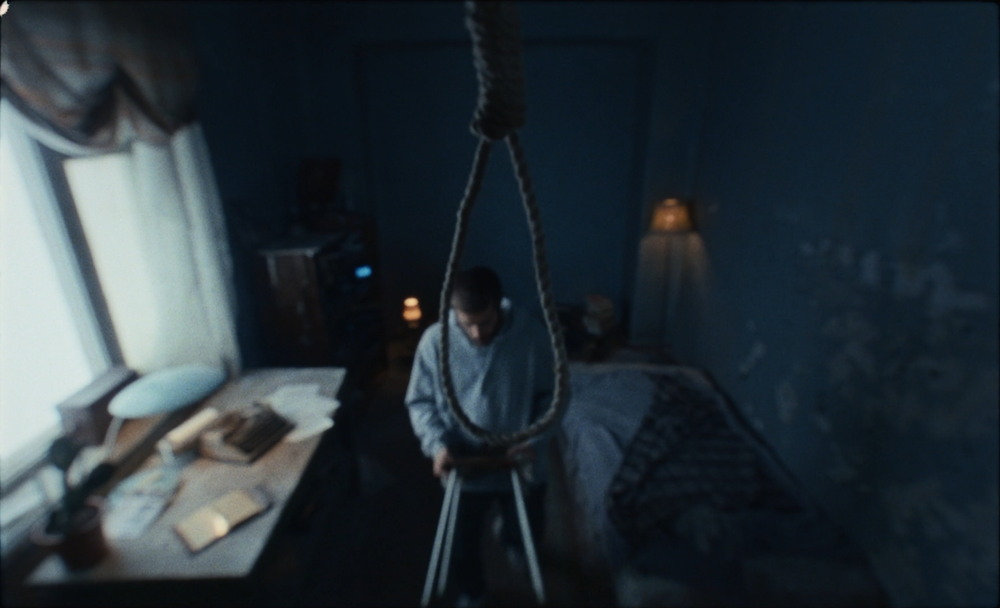
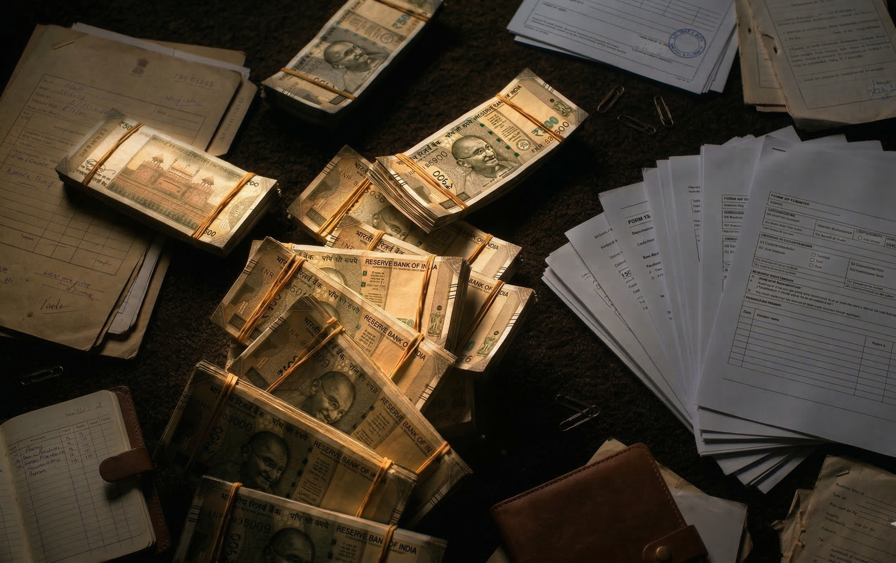

> He who has a why to live for can bear almost any how.
>
> – Nietzsche

***

Ticking clock is the only sound we hear.

There is a crayon painting hanging on the wall, similar to any painting drawn by any child. We hear a young child calling and speaking to her father playfully. A neatly folded school dress of a six-year-old sits on a child's bed. Toys and things thrown on the floor and table. A photo frame of the kid and the mother on the table with a garland on it. The child's voice stops and we hear only the ticking of the clock. Then a stool. Feet on the stool. As we move up, a waist. Then a face. Emotionless. Stone cold. And in front of him hung a rope with a noose to kill himself.

VARUN, 33, looks at the photo of his daughter one last time. He holds the noose determinedly, but just then he receives a phone call. He looks at the phone lying on the table. He gets down from the stool and picks the call.

It is a woman from Bajaj Finance, calling to offer a loan. Varun is disturbed. What does a man do with all the money in the world when he is about to hang? However, the lady on the phone doesn't stop – best interest rates, existing loan porting. Varun tries to interrupt. Fails. Her offer continues, Aadhar card enough, zero hidden fees. Finally, he tells her calmly that he doesn't need a loan because he is going to hang himself now. Immediately she turns quiet.

Irritated, he switches off the mobile phone. He goes back to standing on the stool. In a hurry to end, he takes the noose and puts it around his neck. Just then the doorbell rings. He is aghast. He gets down the stool and walks to the main door.

It is a delivery man, SHANKAR, 30, in delivery man attire. He doesn't even look at Varun. The moment the door is open, he hurriedly opens his delivery bag, picks up a cake box, and hands it over to Varun.

Varun is clueless. He says he didn't order. Shankar is least bothered. He says that it was addressed to Flat 107 and asks whether he is Varun. Varun nods. Then the address is right. But the cake is wrong, says Varun. Shankar suggests he check if someone in the house has ordered it as a surprise, and peeps inside.

His gaze falls on the table that has some LIC insurance papers and a bunch of cash lying. He is taken aback. Greed kicks in him. His demeanour changes. He addresses Varun as Sir, for the first time, and suggests having the cake anyway. Must be someone surprising you, he adds. Passing a smile, his one eye is still on the cash, visible from above the shoulder of Varun. Varun resigns. Taking the cake, he shuts the door. Just as he is shutting the door, Shankar wishes him a happy birthday. Varun doesn't even acknowledge.

Shankar walks down the stairs when his wife calls. She asks about their daughter's school fees. Shankar frustratedly responds that he is trying. He adds that he just delivered his last order and will now ask his friends for a loan. She mocks his poor friends and curses that his daughter too will be poor.

Shankar stands frustrated. He pauses for a while as if to make a decision. He takes his phone and switches it off.

Keeping the cake on the table, Varun walks back to his daughter's room. He goes back to standing on the stool to hang himself when the doorbell rings again. This time he is furious. He can't even die in peace. He ignores the bell and still proceeds to hold the noose. But the doorbell rings twice. He dashes in anger to the door. And is even more angry when he sees Shankar again.

Shankar says OTP. Varun is confused. He explains that Varun must have received an OTP for receiving the delivery, and that his incentive will be cut and the order marked as not delivered. And worse, will be accused of eating the cake, if he doesn't get the OTP.

Varun doesn't have it to fight back. He walks back into the room to get his phone. Meanwhile, Shankar looks at the cash and takes a step inside to steal it. However, Varun returns with the phone and Shankar immediately withdraws. Varun notices that the phone is switched off, and turns it on. Both stare at each other awkwardly as Shankar smiles forcibly and waits for the phone to restart.

Sensing an opportunity to steal, Shankar asks for water. Varun goes in and fetches a glass of water. Shankar looks at the cash, takes a step inside the house when Varun returns with a glass of water. Gulping from the glass, he looks at the cash. The OTP is still not here. Shankar cites network issues and asks whether he can sit for a while until the OTP arrives, owing to too many deliveries since morning.

Varun obliges.

Shankar walks in and puts his large delivery bag at a corner. He looks around the room, gathering any dangers to be aware of. The room looks like it has not been touched or organized for a long time. Food packets, papers, paintings, clothes are lying on the floor and dining table. Listening to the silence of the house, he asks Varun about his family. Varun doesn't answer and is doing chores by picking up some papers lying on the floor.

Shankar enquires about his birthday plans. Varun says that it is not his birthday. It is Meera, his daughter's birthday. Shankar immediately gets up from the sofa. What a coincidence! Shankar shares that it is his daughter's birthday too today. He enquires about the whereabouts of Varun's daughter but Varun instead asks him whether he is rested indicating him to leave indirectly.

Shankar proceeds to show photos of his daughter, Anjali, on the phone. Swiping photos, Shankar shares stories of her mischief. Varun looks at the photos and turns focused as Anjali and Meera are of the same age, six. Shankar's eyes are on cash, while Varun's on Anjali's. Shankar adds that no matter how many problems he has, how tired he is, the moment he goes home at night and she hugs him *papa*, all his problems and tiredness vanish. *There is no meaning to life without her*. Varun is moved, passes a faint smile, looking at the photo of Anjali. This is the first time he has smiled.

Varun goes to his daughter's room when Shankar decides that it's the best opportunity to steal the cash and run. He takes a breath, and carefully walks towards the cash. Just as he is about to take the cash, Varun reenters.

Shankar, sensing getting caught red-handed, immediately moves his hand from cash to the guitar lying beside. It is lying there dead, half covered by a cloth. He hesitantly asks whether Varun plays, almost as if recovering from averting getting caught. Varun just reacts slightly with a nod and hand gesture, suggesting in the past. Shankar mentions he too had started learning it in his youth but couldn't pursue further because of his financial situation and debt accrued by his father and him. Had he had enough money, he would have learnt well like Varun, he mentions. Varun asks whether money can provide relief to the guilty. Shankar is confused.

He asks whether he can touch the guitar. Varun nods, because he's exhausted and wants him out sooner. Shankar takes the guitar and starts tuning it, as Varun too takes a seat. Shankar shares that he wants to teach it to his daughter. She has a small guitar that he had borrowed from someone, but it's broken now and he couldn't afford another. Shankar wants his daughter to pick up music that he couldn't due to poverty.

Shankar starts playing, and Varun notices how he starts off well, as an amateur, but goes off in the following tune rendition. It is a song from Delhi 6. Varun asks him to stop and tells him that he is going off in the low tunes. He takes the guitar himself. Varun tunes it. He held the guitar after ages, but the muscle memory is strong. Varun starts playing almost perfectly. Shankar genuinely is blown away by the rendition. Both are lost in the music. Varun closes his eyes in pleasure of playing the tune and continues playing without a care in the world. And in those few seconds with his eyes closed, something crosses his face. Not peace exactly. More like a memory. Like the music took him somewhere he forgot existed. But Shankar's eyes are wide open and fixed on the cash! He takes one step toward the cash. Then another. He is close now. He reaches out his hand.

The music stops. Varun has opened his eyes and is looking directly at him. Shankar freezes. One beat of silence. Then he starts clapping. Brilliant Sir, brilliant. Varun looks at him one second too long. He asks him to leave.

Suddenly, Shankar's phone rings loudly. It is his wife's video call. His wife asks about fees again. Before Shankar could respond, a little girl snatches the phone and gets on the video. It is Anjali. She enquires his whereabouts, to which Shankar responds by showing Varun and mentions that it is Varun's daughter's birthday today. Varun is awkward at first, but turns calm looking at Anjali on the phone.

Varun wishes Anjali a happy birthday. Anjali immediately snaps that it's not her birthday today. Shankar snatches the phone away from Varun's face. He scrambles for a reason, for rescue, for escape from the lie. He fumbles about the Hindu calendar birthday that his wife follows. He diverts the topic, but Varun turns suspicious now.

Anjali notices the guitar in the background and asks whether Varun's daughter plays it. Shankar says that Varun Uncle plays it and passes the phone to Varun. She asks whether he can teach her. Varun keeps quiet on teaching and passes a customary smile. Varun asks Anjali whether she wants to cut the birthday cake. This is the first time Varun has asked for anything. Anjali asks which flavour. Varun says chocolate. She nods elatedly. Varun proceeds to cut the cake with Anjali despite knowing it's a lie. He sees his daughter in Anjali. They all cut cake together as Shankar sings happy birthday and adds Meera's name too in the song. Varun too sings happy birthday to Meera. This is the first time he has taken her name tonight, and probably the last too. He becomes emotional, imagining his own dead daughter. He steals a glance at the photo of his daughter.

Singing, Shankar looks at the cash, this time with more urgency as his lie is cracking and his time is running out. Amidst the hustle of cake cutting, Shankar moves towards the cash. He puts his hand on the cash when Anjali calls through the phone.

Shankar drops the cash. He picks a piece of cake. With cream on his hands, some cream falls on Shankar's shirt. He asks for the toilet room. Varun, lost in listening to Anjali, points to the bathroom door. Shankar mistakenly walks into the room with the noose rope hanging. He is shocked. Horror runs on his face. He goes silent, dead silent. He immediately pulls the door shut.

Varun sees Shankar seeing the noose rope, but Shankar doesn't realize this.

Shankar then enters the actual toilet room. He is shaken and shocked. He locks the door and flushes. He runs across the bathroom anxiously. He has new information now, about Varun's suicide. Will he be suspected? Should he rescue him? Or just take the money and get lost since he is dying anyway? He has a debt to pay and has to offer a better future to his daughter. He is wrestling with these questions in the bathroom. After moments of wrestling with his mind, he stops at the sink. He washes his face and looks in the mirror. That look of decision.

He emerges from the bathroom.

Varun is standing right outside the bathroom. Shankar is taken aback and fumbles with words. Are his true intentions out in the open? Has he called the cops? Will Varun attack Shankar?

Varun blurts out 6247 with a straight face. Shankar is confused. OTP, Varun adds. Shankar is relieved that he is not caught. But he notices that there is no cash on the table. Realizing that Varun knows about his intention to steal, Shankar quietly takes the OTP and exits the home. Just at the doorstep leaving, Shankar turns around and says – *She's free on Sundays to learn guitar.*

Shankar goes to pick the next delivery. He picks up another package and goes to his bike. He opens the bag to find the same bundle of cash. He is shocked and yet pleasantly surprised. He can't believe it, he gasps for air. He notices a handwritten note beside the cash bundle. He reads it – '*buy her a guitar*'.

Shankar is overcome by an intense emotional rush. He weeps.

Regaining himself, he calls Varun. *'The number you are dialing is switched off, please try again later'.* Will he be alive later? Shankar curses himself. He dials again, same response. He immediately starts the bike and rushes – navigating the traffic, waiting for the elevator, running through stairs – fearing the worst. Finally reaching the house, he crashes open the door.

**THE END**

***

> ALTERNATIVE ENDING B

Varun is standing on the stool. He looks at his daughter and wife's photo one last time. He holds the noose, puts it around his neck. At the exact moment, Shankar bangs through the door. Seeing Varun alive, he falls on his own knees, out of breath. A moment of silence between them. Eerie silence. Regaining breath, he looks at Varun and asks whether Varun can teach music to his daughter Anjali.

There is absolute silence as we slowly zoom into Varun's face. As we close in on his face and stay there, a tear falls through his eye. The tear of hope. He nods mildly and says yes, crying. And gets down from the stool.

> ALTERNATIVE ENDING C

Shankar pushes through the open door and rushes into the room to find only Varun's legs hanging mid-air. Standing there motionless, Shankar gets a call from his daughter.
