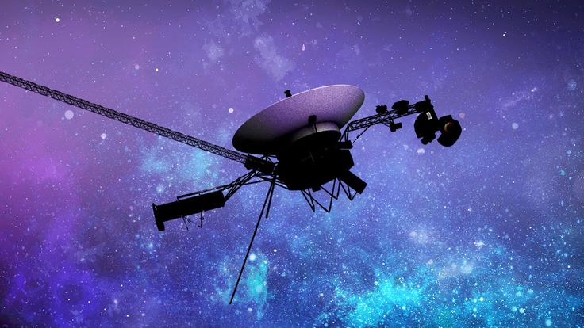
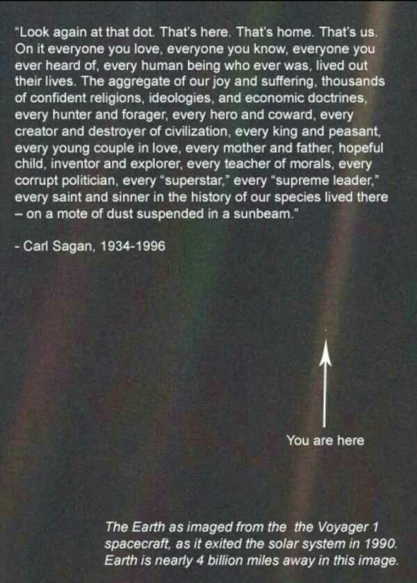

I suspect I'm in love.

Why are you so beautiful that you are out of my reach? I just can't wrap my head around you.

I want to speak to you. Rather I want to listen to you. I want to hold your hand and safely take you to a cozy corner, where you will feel comfortable. I want to hold your cheeks and feel its warmth.

Let's order two beers, and toast to you, your journey, your experiences, your eyes, your body, your every cell, your everything.

But first answer my questions.

How are you?

How is your journey? Are you feeling lonely? What do you think about as you travel?

What miracles have you witnessed? Did you see aliens?

You carried so many things with you. A map, songs of Beethoven and Mozart, voices of a baby crying, greetings in so many languages, sounds of river, wind, and so much more. Did you pass along these things we gave you? Did you share it with anyone?

Did you mock Pluto along the way?

Did you see a wormhole and say – *'Nolan, you bloody genius, are you even human?'* Oh, he is releasing *The Odyssey* in July this year, you will miss it!

I'm sure you travelled listening to Lord Hans Zimmer's *Interstellar* soundtrack. Is *Interstellar* soundtrack declared as the official track of the universe? If not, please write a petition to do so.

How does 61000 kilometers per hour feel? Goosebumps? Are there cops on route checking overspeeding?

I'm mesmerised by you, Voyager 1.

Also, congratulations! You are now the FARTHEST HUMAN-MADE OBJECT FLOATING IN INTERSTELLAR.

You are 1 light-day from earth. That means if I travel at the speed of light, I will reach you in one day. If you see me from where you are, you are seeing yesterday's version of me. I ain't complaining, for I look younger! To put it in plain numbers, you are 26 billion kilometers away. And I didn't go to fix my cycle today as the repair shop is 2 kms away.

When you birthed in 1977, you were not supposed to last this long. And yet here you are, still sending signals like a first love that refuses to fade.

And how can you eat so little and still thrive? You eat just 230 watts, which is less than how much my toilet room bulb eats when I shit!

*Earth from 6 billion kilometers away shot by Voyager 1. Now it is 25 billion kms away. Wonder how do I look from there?*

I miss you, but I'm happy you are travelling places.

They say the soul can travel anywhere. So, we are destined to meet after my death.

Hug me when we meet! Until then, travel safely, Voyager 1!

***

PS: Say Hi to my mother if you run into her.
