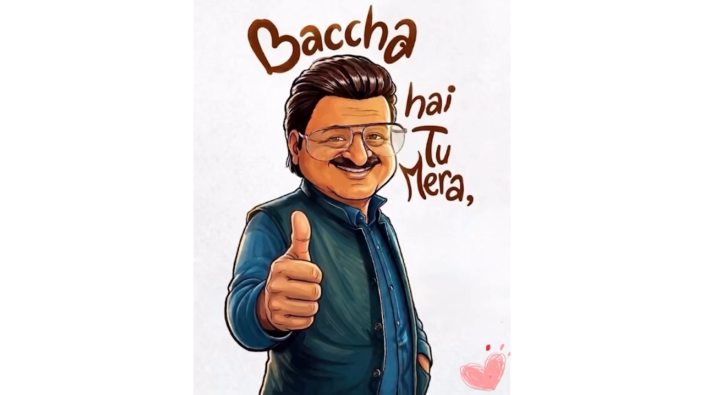

Standing outside his home, leaning against his WagonR car, a man claps. He is not applauding, he is simply preparing his regular dose of gutka. A packet of Vimal (*tobacco*) mixed with another packet of pan masala. Lumping the mixture between index finger and thumb, he shoves it down under the lower lip. 

That’s when we see his face. It’s MANOJ, a man in his early thirties. With a slightly protruding belly signalling his growing prosperity as a real estate agent, he checks wristwatch. 3:40 PM. 

Just then his wife and seven-year-old son come rushing down the stairs, clearly in a hurry. 

*‘Log Dhurandhar dekhne aa rahe ya tumko?’*

His sarcasm doesn’t sit well with her, but she ignores him as she did for years. 

Wearing a red saree and a bit heavily overdressed, REKHA is a dutiful wife, excited to watch the film. Thanks to reels, she is updated about films, politics, and society at large. Technology is a great leveller. 

They hop into the car, excited to watch Dhurandhar. It is also ROCKY, their son’s first film in a cinema hall. Mother sits in the front seat, while Rocky sits in her lap. 

Driving through the congested city streets, Manoj calls with his mouth struggling to open wide.  

‘*Rocky*’.

His mouth is full of *gutka* now. He peeps out of the window in the running car and spits on the freshly painted white road divider wall. The contrast of red and white now is uncomfortably loud.

*“Beta, saamne autorickshaw pe kya likha hai?”*

Rocky struggles to read the quote on the autorickshaw. Manoj is disappointed, but only his face displays it.

Stopping at a traffic signal, Manoj shows another word written on the billboard. Rocky stares at it for a moment. This time employing a strategy, he spells each alphabet calculatedly. 

P-L-E-A-S-U-R-E. Yet, he pronounces the word incorrectly. 

Manoj gets a little agitated, visible on face and comes out in words.

*‘Itne paisa aur influence lagake bade private school mein join karwaya… Kya faida hua.’*

*‘Seek jayega mera ladka’*, the eternal mother defends his son. 

*‘Iski umar ke bacche phat phat bol lete hai’,* Manoj sounds dejected.

Rocky hears the conversation but keeps quiet. 

Just then a beggar comes to the car. Even before the beggar could seek alms, Manoj immediately shoos him away. 

*‘Hatt hatt… Nikal. Kuch nahi hai, nikal nikal.’*

The moment the beggar leaves, Manoj passes a comment. 

*‘Ye madarchod kamathe kyon nahi hai. Nashe karne paise hai, par kaane nahi.’*

Rocky experiences the entire episode in awe. This is the first time he has seen someone beg. He continues looking at the beggar even after the car has moved ahead.

Just as the signal turns orange, Manoj honks as if the vehicle ahead of him is intending to settle down on the street itself. 

Speeding through the road, suddenly a biker crosses Manoj, rubbing him off wrongly.

*‘Madarchod, dikai nahi deta kya?’*

Manoj’s abuse didn’t fall on the biker, but it did on his wife and kid’s ears. 

They reach the theater just on time when the film is to start. Rocky is excited to watch his first film. So is his mother. 

Occupying their seats, the popcorn tumbler humbly sits on the lap of Rocky, who is seated between his parents. 

Twenty minutes into the film, all three are hooked into the screen. Suddenly Rocky calls. 

*‘Maa… Maa, Maa.’*

Assuming his call is for the cold drink, she passes it without moving her gaze from the screen. 

*‘Papa, papa.’*

He too is glued to the screen, but he brings his ear closer to Rocky, while his eyes are still on the screen. 

*‘Papa, isme kuch problem hai.’* Rocky said pointing to the screen.

Manoj looks at him with curiosity. 

*‘Jab bhi hero **Madarchod** bolta hai, beep aa raha hai.’*

Everything around goes silent for the parents. Both parents look at Rocky, and then at each other in shock. 

The silence is broken when, in the background on-screen, Rakesh Bedi (Jameel Jamali) says – 

*‘Baccha hai tu mera’*.

