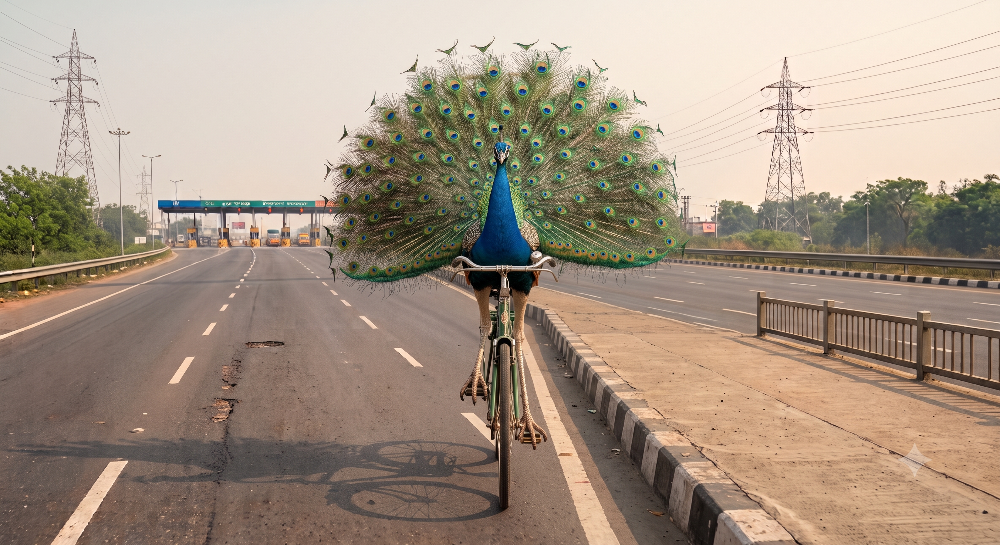
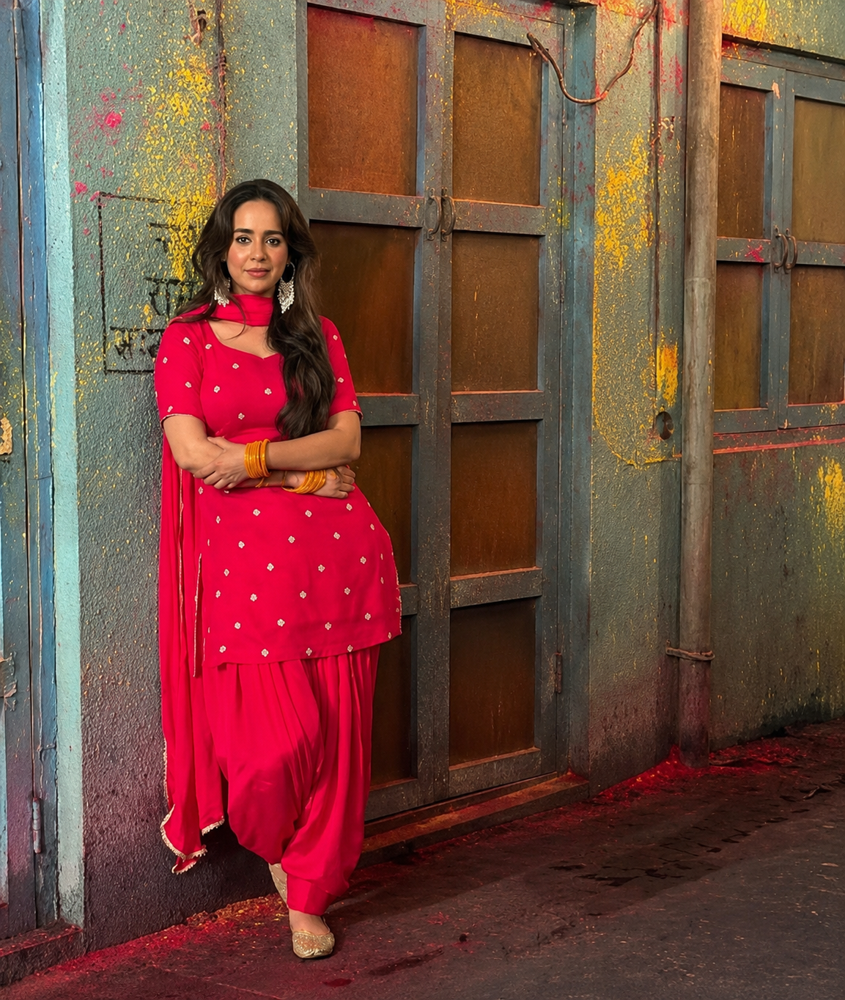
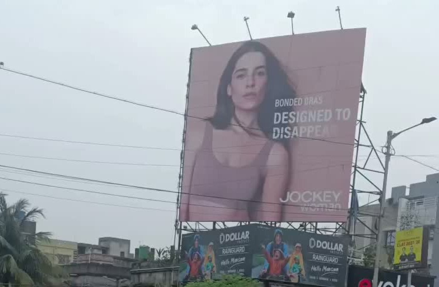

I was a peacock today.

They say a peacock dances when it rains. The moment it started raining today, something took over me. I rushed back to my room, changed my clothes, and took my Avatar (my bicycle) for a ride. It was involuntary. I was a peacock today.

Blissful.

I can cycle anywhere. Oh wait, I can cycle to her. In fact I can cycle till this road touches the ocean. I can pedal to Mars. Worst case, I will die en route in space with Interstellar music playing in the background.

I'll cycle to Sunanda Sharma's office. She has possessed me this morning since I watched her in Karan Aujla's 'Boyfriend' song. In that colourful Punjabi attire, in that lively choreography, she was an embodiment of grace. I was zapped. All the while cycling I was thinking about her electric energy in the video. Should I write to the choreographer for composing such peppy steps?

I should work with Sunanda Sharma. But in a more gritty, anti-heroine, painful role. If she can dance away to a heart, then I'm sure she can also hurt it. The range is interesting to explore.

Why is this stone lying there? Since when is it lying here? How many people must have kicked it for it to reach here? Has it been in existence for billions of years? Oh wait, this stone knows about the Big Bang?

Oh who is that woman crossing the road? What face is that... mysterious. I should cast her in Meera script. Will she act?

That Jockey billboard, I don't agree with it. First it said, it's just a piece of cloth. Now it says cloth that disappears. Brand positioning inconsistency.

Sunanda Sharma's peppy dance on Aujla's song in rain... Bring it on! Her lively dance flashes through with beats pushing me to pedal stronger.

Mad Max: Fury Road. I should study it again; I can't get over its sound, its cinematography, its writing, its design, its edit, its thrill, its feel. It has deeply impacted me. I watched it four times and its effect doesn't wear off.

I've hands, I've legs. Fuck, I can do anything. I can work in a petrol pump, I can also write a kick-ass script.

When the fuck will I complete my feature scripts? There's so much to do and so little time.

Should I take the right to say hi to a friend in his office? Na, I'll only visit that office with a script.

Gotta watch The Odyssey again. What sorcery it is!

Cycling in the rain is almost orgasmic today. Should I ride hands-off?

There is a big puddle coming up. Don't take it, don't ride in it, don't, don't.

Splashhhhhhhhh!

Grateful for the day.

And thanks, Sunanda and Aujla and choreographers Mohit and Serene!
