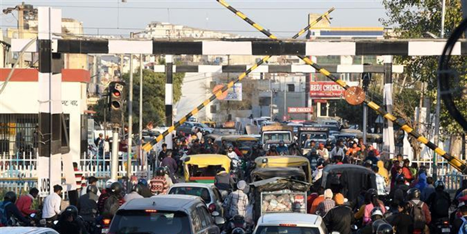

The air is heavy.

Palpable tension ran through the nerves like current.

Wearing helmets, every man was equipped with at least 100 kg of ammunition to destroy the other side. Both sides are fuming, raring to kill each other.

A mere thin line separated them.

A simple command would trigger a massive war. There will be a winner. But has a war ever won?

A large tank slowly positions itself to attack, triggering slight commotion. Some unsuspecting men sneak out, disrespecting the rules of war.

As the time approaches, both sides have their eyes turn red. In moments from now, the land will witness an onslaught, raging men hunting down each other.

**BHAAAAAAAAAAAMMMMMMMMMMMMMMMMMM!**

The loud honk brings me back to reality.

Gotta fight, bye!

